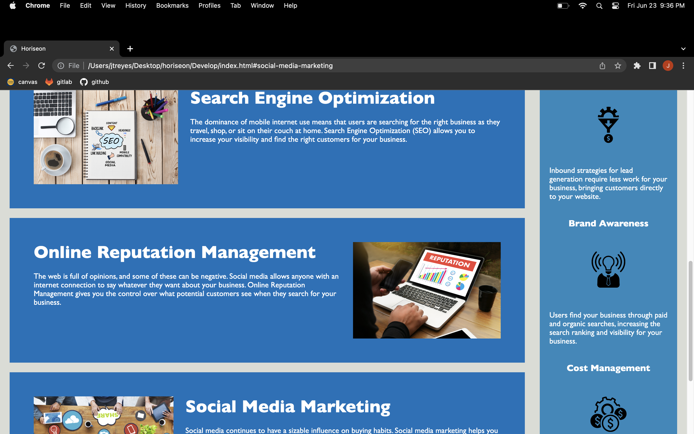

# Your Project Title 

## Technology Used 

| Technology Used         | Resource URL           | 
| ------------- |:-------------:| 
| HTML    | [https://developer.mozilla.org/en-US/docs/Web/HTML](https://developer.mozilla.org/en-US/docs/Web/HTML) | 
| CSS     | [https://developer.mozilla.org/en-US/docs/Web/CSS](https://developer.mozilla.org/en-US/docs/Web/CSS)      |   
| Git | [https://git-scm.com/](https://git-scm.com/)     |    

## Description 

[Visit the Deployed Site](https://jesustgr.github.io/horiseon/)

Web accessibility is an increasingly important consideration for businesses. It ensures that people with disabilities can access a website using assistive technologies such as video captions, screen readers, and braille keyboards. Making a website accessible is also good for business for many reasons, one of them being that accessible sites are better positioned in search engines like Google. It also helps companies avoid litigation that can occur when people with disabilities can't access their website.

To impress clients, one should always go the extra mile and continuously look to improve the codebase. For example, make sure that all links are functioning correctly. Also, rework the CSS to make it more efficient by consolidating CSS selectors and properties, organizing them to follow the semantic structure of the HTML elements, and including comments before each element or section of the page.

Given starter code for the website of a marketing agency, Horiseoon, I was tasked with improving or REFACTORING the codebase for long-term sustainability. This site now has a codebase that follows accessibility standards, optimizing it for search engines. It has a clear and concise title. Heading attributes fall in sequential order. The source code contains semantic HTML elements that follow a logical structure independent of styling and positioning. And all image elements have accessible alt attributes.


## Code Refactor Example


```html
<div class="header">
        <h1>Hori<span class="seo">seo</span>n</h1>
        <div>
            <ul>
                <li>
                    <a href="#search-engine-optimization">Search Engine Optimization</a>
                </li>
                <li>
                    <a href="#online-reputation-management">Online Reputation Management</a>
                </li>
                <li>
                    <a href="#social-media-marketing">Social Media Marketing</a>
                </li>
            </ul>
        </div>
    </div>
```

Converting the above non-semantic div with the class of 'header' to an appropriate [<header> semantic element](https://www.w3schools.com/html/html5_semantic_elements.asp). 

```html
<header>
        <h1>Hori<span class="seo">seo</span>n</h1>
        <nav>
            <ul>
                <li>
                    <a href="#search-engine-optimization">Search Engine Optimization</a>
                </li>
                <li>
                    <a href="#online-reputation-management">Online Reputation Management</a>
                </li>
                <li>
                    <a href="#social-media-marketing">Social Media Marketing</a>
                </li>
            </ul>
        </nav>
    </header>

```

This change require some additional modification to the CSS selector: 

```css
.header {
    padding: 20px;
    font-family: 'Trebuchet MS', 'Lucida Sans Unicode', 'Lucida Grande', 'Lucida Sans', Arial, sans-serif;
    background-color: #2a607c;
    color: #ffffff;
}
```

No longer targeting the element on the page with the class of 'header' but instead the css selector targeting the 'header' element 

```css
header {
    padding: 20px;
    font-family: 'Trebuchet MS', 'Lucida Sans Unicode', 'Lucida Grande', 'Lucida Sans', Arial, sans-serif;
    background-color: #2a607c;
    color: #ffffff;
}

```


## Usage 


Each link in the header corresponds to one of the three sections that make up the meat of the website.



## Learning Points 


As I was working through this task, I learned the importance of commenting as you go. Having a reference as to what a chunk of code does saves one a lot of backtracking. I also learned exactly why we are encouraged to commit often. I found myself making changes in the source code, only for it to not show up how I expect it to on the website. Referencing prior commits helped a ton during the process. Lastly, resources such as Mozilla and W3 are LIFESAVERS, especially when it came to having to remember what is considered semantic and nonsemantic. All in all, completing this task has got me feeling like I am gaining the correct habits and am adjusting to life as a developer.


## Author Info

### Jesus Thomas Reyes


- [LinkedIn](https://www.linkedin.com/in/jesus-thomas-reyes-aa001a192/)
- [Github](https://github.com/jesustgr)